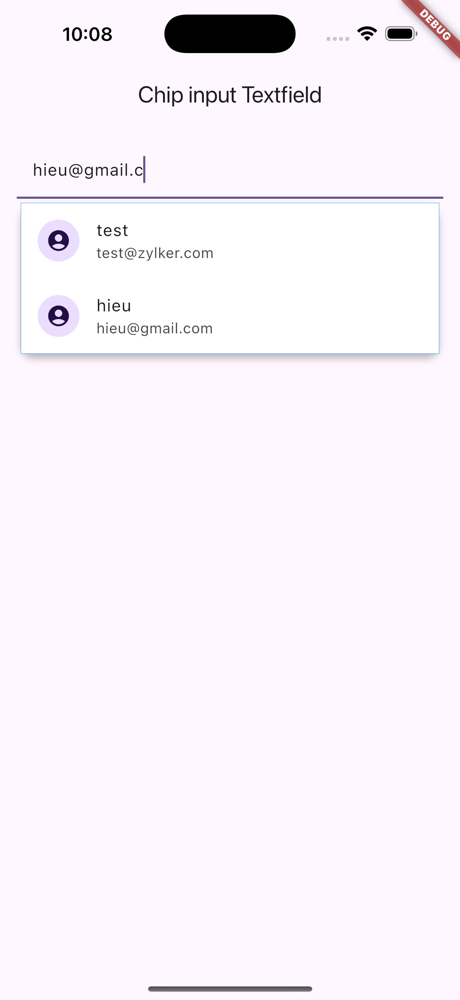

ChipInputTextField is a TextField widget which is used to convert the give input to a Chip based on
the validation provided.
User must return a List`<ValidatedData>` from the Validate function. ValidatedData contains the value
and meta data that denotes chip can be created with the item or the item must be a String.
The chip can be customized based on the user needs.

This component also help with custom suggestionBuilder based on the last input.

| Attributes        | Input                                                                  | Description                                                             |
|-------------------|------------------------------------------------------------------------|-------------------------------------------------------------------------|
| validate          | (inputText) {// return list of ValidatedData based on the requirement} | The returned list will be iterated and renders chip for the valid items |
| chipBuilder       | (context, state, value, controller) { //return a Chip Widget }         | Used to build a custom chip UI                                          |
| suggestionFinder  | (query) {//return a List of required data}                             | Used to provide suggestions based on the latest input                   |
| suggestionBuilder | (context, state, data){ // return widgets to show suggestions}         | Used to build a custom UI for suggestions                               |


----



## Use

```
ChipInputTextField<ContactInfo>(
  onChange: (value) {},
  focusNode: chipFocusNode,
  showSuggestions: true,
  suggestionFinder: (query) {
    return <ContactInfo>[
      ContactInfo(email: "test@zylker.com", name: "test", id: 100),
      ContactInfo(email: "hieu@gmail.com", name: "hieu", id: 1),
      
      ];
  },
  chipBuilder: (context, state, value, controller) {
    ContactInfo data = ContactInfo(email: value, name: value.split("@").first, id: -1);
    return InputChip(
      key: ObjectKey(data),
      label: Text(data.name),
      avatar: Container(
        width: 24,
        height: 24,
        decoration: BoxDecoration(borderRadius: BorderRadius.circular(12)),
        child: const Icon(Icons.account_circle),
      ),
      onDeleted: () {
        state.deleteZTChip(data.email, controller);
        usersList[0].emails.remove(data.email);
      },
      // materialTapTargetSize: MaterialTapTargetSize.shrinkWrap,
    );
  },
  suggestionBuilder: (context, state, data) {
    return ListTile(
      key: ObjectKey(data),
      leading: const CircleAvatar(
          backgroundColor: Colors.white,
          child: CircleAvatar(child: Icon(Icons.account_circle))),
      title: Text(data.name),
      subtitle: Text(data.email),
      onTap: () {
        state.selectSuggestion(data);
      },
    );
  },
  validate: (inputText) {
    String? inValidEmail, validEmail;
    List<ValidatedData> list = [];
    String emailString = inputText.replaceAll(",", " ");
    if (emailString.contains(" ")) {
      validEmail = emailString.substring(0, emailString.lastIndexOf(" "));
      inValidEmail =
          emailString.substring(emailString.lastIndexOf(" "), emailString.length);
    } else {
      inValidEmail = emailString;
    }
    if (validEmail != null) {
      List<String> emailList = validEmail.split(" ");
      for (var email in emailList) {
        var emailValid = emailRegex.hasMatch(email);

        if (emailValid) {
          list.add(ValidatedData(value: email, canConvertToChip: true));
        } else {
          list.add(ValidatedData(value: email, canConvertToChip: false));
        }
      }
    }
    list.add(ValidatedData(value: inValidEmail, canConvertToChip: false));
                  return list;
  },
),
```